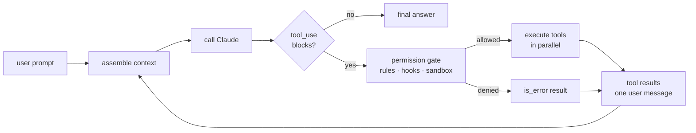
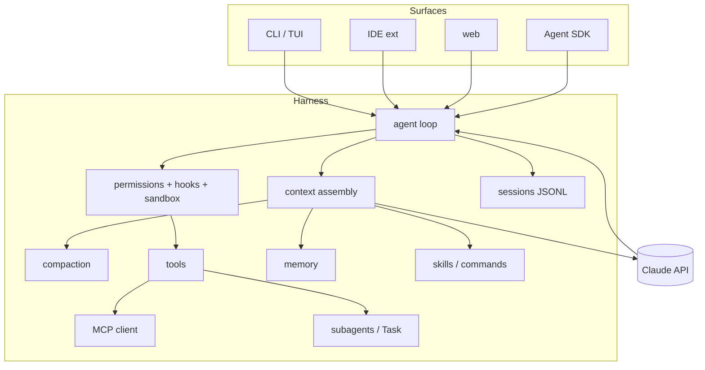
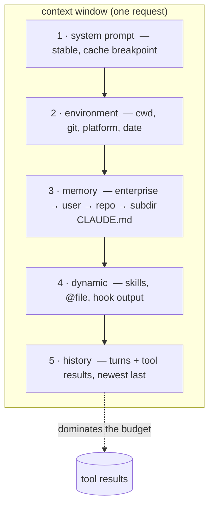
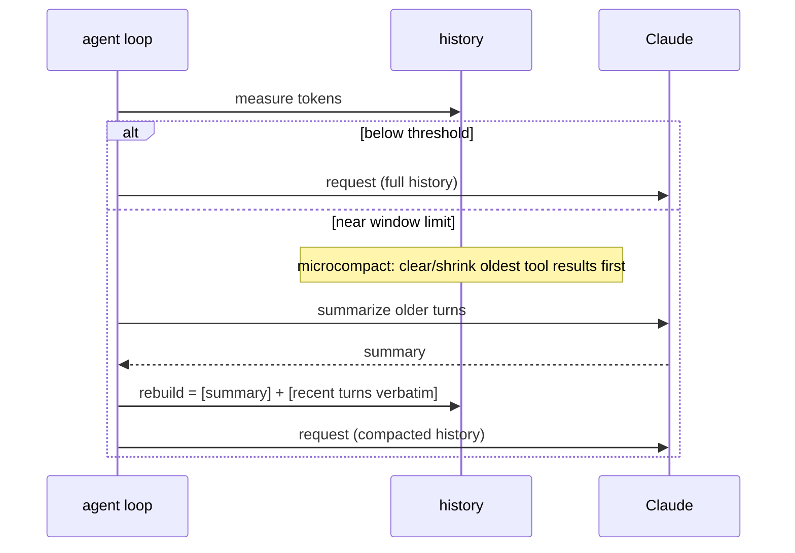
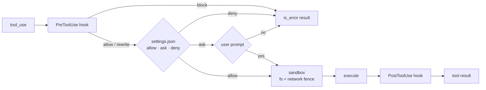
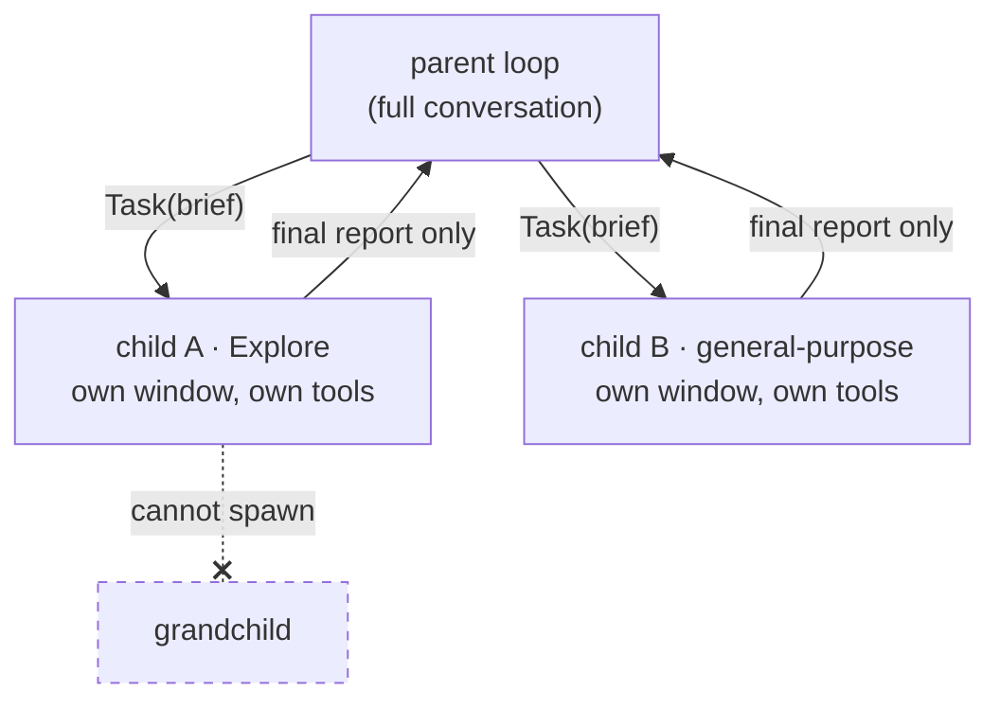
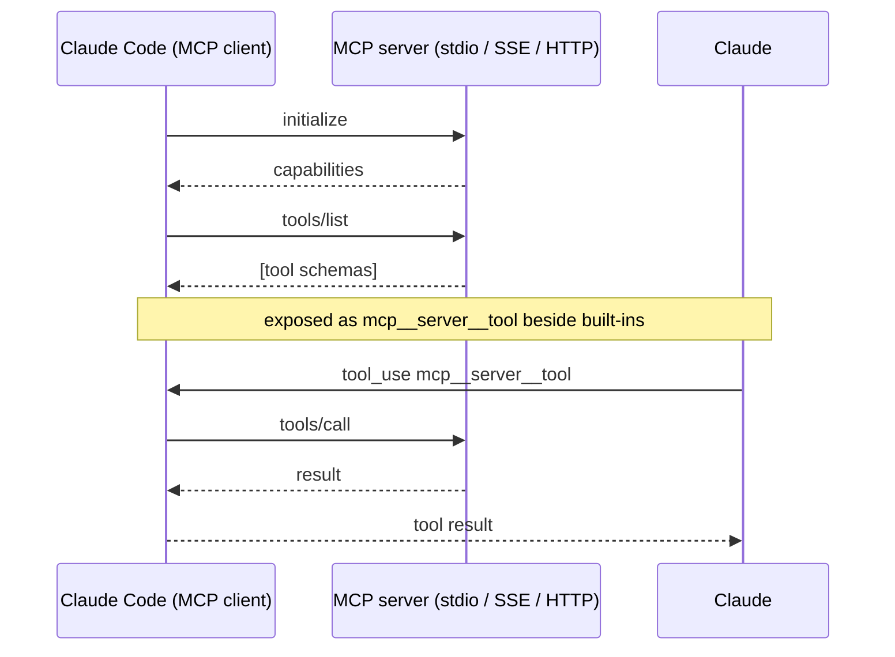
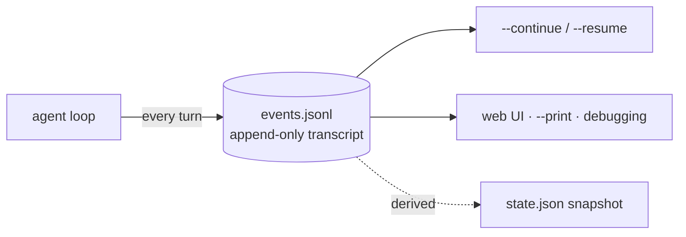

# Claude Code: how the real harness works

An architecture deep-dive of Anthropic's Claude Code, written to be read next to
[`../cc-1/`](../cc-1/), the from-scratch reimplementation of the same mechanics.

> **Why there is no source code in this folder.** The "leaked Claude Code source"
> repos circulating online are deobfuscated dumps of Anthropic's proprietary,
> closed-source CLI bundle. They are unauthorized redistributions — copying one
> into this repo would republish it, so that is not done here. Everything below
> comes from public material instead: the official docs
> ([code.claude.com/docs](https://code.claude.com/docs)), Anthropic's engineering
> posts, the open-source [Claude Agent SDK](https://code.claude.com/docs/en/agent-sdk)
> (which *is* the Claude Code harness packaged as a library), and observable
> behavior of the shipped product. That is also the more useful source: the
> architecture is the interesting part, and the architecture is public.

---

## 1. The 30-second picture

Claude Code is a **single-process terminal harness** around one idea:

```
                ┌──────────────────────────────────────────────┐
                │                 agent loop                    │
   user prompt  │                                              │
  ────────────► │  assemble context ─► call Claude ─► done? ───┼──► answer
                │        ▲                   │                 │
                │        │              tool_use blocks        │
                │        │                   ▼                 │
                │   tool results ◄── execute tools             │
                │                (permissions, sandbox)        │
                └──────────────────────────────────────────────┘
```

The model does the thinking; the harness does everything else — assembling what
the model sees, executing what the model asks for, deciding what it is *allowed*
to ask for, and keeping the whole thing inside a finite context window. Every
subsystem below is one of those four jobs.



## 2. Anatomy

| Layer | What it does | cc-1 equivalent |
|---|---|---|
| CLI / TUI (or IDE, web, SDK surface) | render the conversation, capture input | `cli.py`, `ui/` |
| Agent loop | the request→tool→request cycle | `agent.py` |
| Context assembly | system prompt, CLAUDE.md, env info, history | `context.py` |
| Compaction | keep the conversation inside the window | `compaction.py` |
| Tools | Read/Write/Edit/Bash/Glob/Grep/WebFetch/Task/TodoWrite… | `tools/` |
| Permissions + hooks | who may run what, user-defined interception | `tools/__init__.py` policy |
| MCP client | attach external tool servers | `mcp/` |
| Subagents (Task tool) | isolated child contexts | `orchestrator.py` |
| Memory (CLAUDE.md, auto-memory) | durable knowledge across sessions | `memory.py` |
| Sessions | JSONL transcripts, resume/continue | `session.py` |
| Skills / slash commands | packaged instructions loaded on demand | (not modeled) |



## 3. Context engineering

The model is stateless; every request re-sends everything. Claude Code treats
the window as a budget and spends it in a deliberate order:

1. **System prompt** — the harness's own identity, tool-use rules, safety
   policy, tone guidance. Stable across turns, so it sits first and carries a
   prompt-cache breakpoint (an agent loop re-sends its prefix dozens of times;
   caching it is the difference between usable and unusable economics).
2. **Environment** — cwd, git status, platform, date.
3. **Memory files** — `CLAUDE.md` resolved hierarchically: enterprise policy →
   `~/.claude/CLAUDE.md` (user) → repo root → subdirectory. Nearer files win.
4. **Dynamic attachments** — skill instructions when triggered, `@file`
   mentions, hook output injected as synthetic turns.
5. **Conversation history** — turns and tool results, newest last.

Tool *results* dominate the budget in practice — one careless `cat` of a large
file costs more than the entire system prompt — which is why the tools
truncate output, why `Read` has offset/limit, and why the guidance to the model
is "search, don't dump."



## 4. Compaction and the context lifecycle

When the conversation approaches the window limit, Claude Code **compacts**: it
asks the model to summarize the older conversation, then rebuilds history as
`[summary] + [recent turns kept verbatim]`. The user sees this as auto-compact
(or runs `/compact` manually). Two refinements worth knowing:

- **Microcompaction** targets the biggest, coldest chunks first — old tool
  results get cleared or shrunk before anything conversational is touched.
- Compaction is lossy by design. Decisions survive; raw bytes do not. That is
  why durable facts belong in CLAUDE.md or notes *before* compaction, and why
  the escape hatch for big work is not a bigger window but **subagents**.

`cc-1` implements the same triple: threshold trigger, summarize-the-old,
keep-recent-verbatim (`compaction.py`), with the same "write it to memory
first" pressure valve (`memory.py`).



## 5. Tools

The built-in surface is small and file-centric: `Read`, `Write`, `Edit`,
`Glob`, `Grep`, `Bash` (persistent shell, background jobs), `WebFetch` /
`WebSearch`, `TodoWrite` (the visible plan), `Task` (spawn a subagent),
`NotebookEdit`, and on some surfaces `AskUserQuestion`. Three design rules
recur:

- **Errors are data.** A failed tool returns `is_error: true` with a message
  the model can read and react to; the loop never throws.
- **Parallelism is preserved.** One assistant turn may carry several tool_use
  blocks; all results return in a single user message.
- **Output is budgeted.** Every tool truncates; the model is told how to page.

### Permissions, hooks, sandboxing

Every tool call passes a gate before executing:

- **Permission rules** (`settings.json` allow/ask/deny lists, per tool and per
  pattern — `Bash(npm test:*)`, `Read(src/**)`) decide silently-allow vs
  prompt-the-user vs refuse. Modes: default, `acceptEdits`, `plan` (read-only),
  `bypassPermissions`.
- **Hooks** — user-defined shell commands at lifecycle points (PreToolUse,
  PostToolUse, SessionStart, Stop…) that can observe, block, or rewrite a call.
  Deterministic policy where prompting the model would be unreliable.
- **Sandboxing** — OS-level (seatbelt/bubblewrap) filesystem+network isolation
  for Bash on supported platforms, so "allowed" still doesn't mean "unfenced".

`cc-1` models the first layer only (a `PermissionPolicy` with auto/readonly/
allowlist modes, a workspace jail, and a binary allowlist for the shell).



## 6. Subagents and orchestration

The `Task` tool spawns a **subagent**: a fresh agent loop with its own clean
context window, a role-specific system prompt (built-in types like
general-purpose/Explore, or user-defined ones in `.claude/agents/*.md` with
their own tool grants and model choice), and *no visibility* into the parent's
conversation. The parent passes a task brief; the child returns only its final
report, which lands in the parent's context as a tool result.

Why this is the scaling mechanism:

- **Context isolation** — a child can burn 100k tokens grepping and reading;
  the parent pays only for the summary that comes back.
- **Least privilege** — each agent type carries its own tool surface.
- **Parallelism** — multiple Task calls in one turn run children concurrently.
- **Bounded depth** — children can't spawn grandchildren (fork-bomb guard).

`cc-1/orchestrator.py` is this in miniature: role registry, per-role budgets
and tool surfaces, parent/child records, depth cap, summarized returns —
plus a UI that draws the tree live.



## 7. MCP

Model Context Protocol servers extend the tool surface with tools the harness
does not ship: `claude mcp add` registers a server (stdio subprocess, SSE, or
HTTP), the client performs the `initialize` / `tools/list` handshake, and each
discovered tool appears to the model as `mcp__<server>__<tool>` next to the
built-ins. The model cannot tell them apart — that opacity is the point.
Claude Code is also an MCP *server* (`claude mcp serve`), exposing its own
tools to other MCP clients.

`cc-1` implements the client and two stdio servers from bare JSON-RPC
(`mcp/protocol.py`) — about 150 lines total, which is a good way to see that
MCP is a small protocol with a big ecosystem.



## 8. Memory

| Tier | Mechanism | Lifetime |
|---|---|---|
| Standing instructions | `CLAUDE.md` hierarchy (enterprise/user/repo/dir), `#` to append | permanent, versioned with the repo |
| Learned notes | auto-memory directory maintained by the model itself | cross-session |
| Session state | JSONL transcript per session | archival |

The division of labor: CLAUDE.md is *loaded always* (so keep it short — it is
a standing tax on every request); transcripts are *loaded never* (they are
what `--resume` reconstructs a session from); auto-memory sits between.

## 9. Sessions

Every session is an append-only JSONL transcript under
`~/.claude/projects/<project-hash>/`. `claude --continue` reopens the latest,
`claude --resume` picks from a list; compaction state, todos, and hook state
ride along. The transcript-as-source-of-truth design is what makes the web
UI, `claude --print` scripting mode, and post-hoc debugging all read the same
story. `cc-1/session.py` copies this: `events.jsonl` is authoritative,
`state.json` is a derived snapshot, resume carries notes — not raw history —
forward.



## 10. Planning modes

Two distinct mechanisms often conflated:

- **Plan mode** (shift+tab) — a *permission posture*: the agent may only read
  and research, then presents a plan for approval before anything mutates.
- **TodoWrite** — a *tool*: the model records and updates a step list that the
  UI renders and that keeps the model itself on track (writing the plan into
  context is self-prompting).

`cc-1` models TodoWrite (`tools/todos.py`); plan mode falls out of the
permission policy's `readonly` mode.

## 11. Skills, slash commands, output styles

Instructions-as-data, loaded into context on demand rather than baked into the
harness: skills (`SKILL.md` + resources, auto-triggered by description match
or invoked as `/name`), user slash commands (`.claude/commands/*.md`), and
output styles (replace parts of the system prompt). The mechanism to notice:
the harness stays generic; capability arrives as *content*.

## 12. The Agent SDK

The Claude Agent SDK (`claude-agent-sdk` for Python/TypeScript) is this whole
harness — loop, tools, permissions, MCP, subagents, sessions — packaged as a
library: `query(prompt, options)` and you have Claude Code running on your own
infra without the TUI. If you need the real thing programmatically, use that.
If you want to *understand* the real thing, build `cc-1` — which is exactly
what the next folder is.

---

## Reading map: cc-1 ↔ this document

| Want to see… | Read |
|---|---|
| the loop itself | `cc-1/harness/agent.py` (§1, §5) |
| context assembly + budgets | `cc-1/harness/context.py` (§3) |
| compaction firing mid-run | `cc-1/harness/compaction.py`, then run the smoke test (§4) |
| spawn/isolation/summarized return | `cc-1/harness/orchestrator.py` (§6) |
| MCP handshake on the wire | `cc-1/harness/mcp/protocol.py` + `client.py` (§7) |
| memory tiers | `cc-1/harness/memory.py` (§8) |
| sessions + resume | `cc-1/harness/session.py` (§9) |
| all of it, live | `cc-1/server.py` + `ui/` (the watchtower) |
