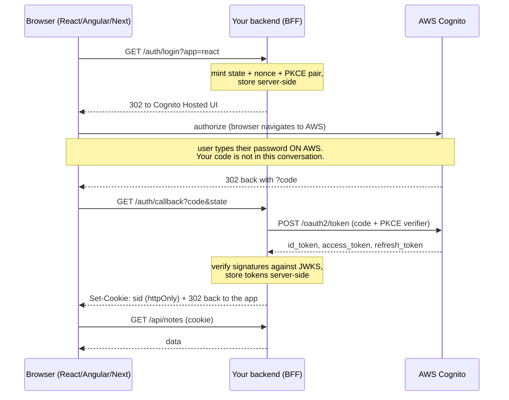

# AWS Cognito login, three UIs, one backend

Three frontends — **React**, **Angular**, **Next.js** — that all sign users in with
**AWS Cognito** through **one shared backend**. Everything runs locally with mock data
and a mock identity provider, so you can play with it without an AWS account, then flip
one environment variable to point at a real user pool.

```
oauth2/
├── backend/   Express BFF. Owns the OAuth2 flow + the demo API. Ships a mock IdP.
├── react/     React 18 + Vite + TypeScript
├── angular/   Angular 19, standalone components + signals
└── nextjs/    Next.js 15, App Router
```

---

## The question this repo answers

> Does the UI hit the backend first and get routed to AWS, or does it hit AWS directly?

**Both, in the right order.** The UI makes exactly one call to your backend, and that call
immediately hands the browser off to AWS. Then AWS hands the browser back to your backend,
not to the UI.



The three properties that make this the right shape:

1. **The password is typed on an AWS-hosted page.** Not on your form, not through your
   backend. You are never in the credential path, so you can't leak what you never held.
2. **The redirect URI points at the backend**, not the UI. That is what lets the
   authorization code be redeemed server-to-server, where the PKCE verifier and the client
   secret live.
3. **No token ever reaches JavaScript.** The browser gets an `httpOnly` session cookie. An
   XSS on your page can *call* your API as the user (nothing prevents that), but it cannot
   *steal* a refresh token and keep using it from somewhere else, for months.

### The two alternatives, and why not

| Approach | What happens | Verdict |
|---|---|---|
| **UI posts username/password to your backend**, backend calls `InitiateAuth` | Your form, your server, and your logs are all in the credential path. No hosted MFA, no social/SAML federation, no Cognito-managed password reset. | Avoid. Cognito supports it (`USER_PASSWORD_AUTH`) but it exists for migration, not for greenfield web apps. |
| **UI talks to Cognito directly** (Amplify / oidc-client), tokens in the browser | Legitimate and common; PKCE makes it safe against interception. But the SPA now holds a refresh token in JS-reachable storage, cannot use a client secret, and every app re-implements refresh. | Fine for a pure SPA with no backend. Once you have a backend, the BFF below is strictly better. |
| **This repo: BFF** | Browser redirects to AWS; backend redeems the code and holds the tokens; browser gets a cookie. | Current best practice for browser apps that have a backend. |

> Not a browser? Then the token *is* the credential. This backend also accepts
> `Authorization: Bearer <access token>` on every API route, verified the same way, for
> mobile apps, CLIs and service-to-service calls.

---

## Quick start

Four terminals. The backend must be first; the UIs are interchangeable.

```bash
# 1. backend — http://localhost:8080
cd backend && npm install && cp .env.example .env && npm run dev

# 2. react   — http://localhost:5173
cd react && npm install && npm run dev

# 3. angular — http://localhost:4200
cd angular && npm install && npm run dev

# 4. nextjs  — http://localhost:3000
cd nextjs && npm install && npm run dev
```

Or start all four at once: `./dev.sh`

Sign in as either mock user, password `Password1!`:

| user | groups | can do |
|---|---|---|
| `alice` | `admin` | delete anyone's note, call the admin route |
| `bob` | `viewer` | only touch their own notes |

Open two of the UIs side by side and sign in on both — they share one backend, so a note
added in Angular shows up in React on reload.

### Prove it works without a browser

```bash
cd backend && npm run smoke
```

Boots the server and walks every hop of the flow — authorize, PKCE, code exchange, session
cookie, CSRF, group checks, Bearer path, logout — asserting at each step. 37 checks.

---

## How the mock mode works

`AUTH_MODE=mock` serves a **real OIDC provider** at `/mock-idp`, not a stub. It publishes a
discovery document and a JWKS, enforces PKCE `S256`, and signs genuine RS256 JWTs whose
claims match Cognito's shape (`token_use`, `client_id`, `cognito:groups`, …).

That is deliberate: the backend verifies tokens with `jose` + a remote JWKS, and runs the
**identical code path** against the mock and against AWS. There is no `if (mock)` anywhere
in the flow. What works locally works against a real user pool.

---

## Switching to a real Cognito user pool

In the AWS console, create a user pool with a Hosted UI domain and an app client:

| Setting | Value |
| --- | --- |
| Allowed callback URL | `http://localhost:8080/auth/callback` |
| Allowed sign-out URL | `http://localhost:8080/auth/logout/callback` |
| OAuth grant type | Authorization code grant |
| OAuth scopes | `openid`, `email`, `profile` |
| Client secret | Generate one — this is a confidential client |

Then in `backend/.env`:

```bash
AUTH_MODE=cognito
COGNITO_REGION=us-east-1
COGNITO_USER_POOL_ID=us-east-1_abc123XYZ
COGNITO_DOMAIN=my-app.auth.us-east-1.amazoncognito.com
COGNITO_CLIENT_ID=...
COGNITO_CLIENT_SECRET=...
```

Nothing changes in the three UIs. They don't know which provider is behind the backend —
that is the point of the `/auth/config` endpoint being the only thing they read.

Add users to an `admin` group in the pool to see the group-gated routes light up. The AWS
SDK is used for `GlobalSignOut` (revoking refresh tokens at logout) and `GetUser`, so the
backend needs AWS credentials in this mode: `AWS_PROFILE` locally, a task or execution role
on ECS/Lambda.

---

## What each part does

### `backend/` — the interesting half

| File | Role |
| --- | --- |
| `src/routes/auth.routes.js` | The four-step flow: `/auth/login` → `/auth/callback` → `/auth/session` → `/auth/logout` |
| `src/auth/oidc.js` | Authorize URL, code exchange, refresh, logout URL, AWS SDK calls |
| `src/auth/tokens.js` | JWKS verification of access and ID tokens |
| `src/auth/middleware.js` | `requireAuth`, `requireCsrf`, `requireGroup`, transparent refresh |
| `src/auth/store.js` | Login transactions and sessions (in memory — swap for Redis/DynamoDB) |
| `src/mock/idp.js` | The local OIDC provider |
| `src/routes/api.routes.js` | The demo notes API |

### The three UIs

Same screens, same behaviour, idiomatic in each framework. Roughly 120 lines of auth code
each, and none of it is token handling:

| | React | Angular | Next.js |
| --- | --- | --- | --- |
| State | Context + hooks | `signal()` in a root service | Context + hooks (`'use client'`) |
| HTTP | `fetch` wrapper | `HttpClient` + interceptor | `fetch` wrapper |
| Credentials | `credentials: 'include'` | `withCredentials: true` | `credentials: 'include'` |
| Config | `VITE_API_BASE_URL` | `src/environment.ts` | `NEXT_PUBLIC_API_BASE_URL` |

Two framework-specific notes worth knowing:

- **Angular** ships an XSRF interceptor, but it deliberately skips absolute URLs, so it
  will not attach the header to a cross-origin API. `credentials.interceptor.ts` does it.
- **Next.js** has its own server, so it *could* host the BFF itself in `app/api/` route
  handlers. It doesn't here, because the whole point is three UIs sharing one backend. In a
  Next-only product, moving `/auth/*` into the app is a good call — the flow is identical.

---

## Security decisions, and why

| Decision | Reason |
| --- | --- |
| Authorization code + **PKCE**, never implicit | The implicit flow puts tokens in the URL bar, browser history and referrer headers. It's deprecated. |
| **PKCE generated server-side** | The server redeems the code, so the server holds the verifier. It never leaves the process. |
| **`state`, plus an `httpOnly` transaction cookie** | `state` alone proves the response belongs to *some* request of ours; binding it to a cookie proves it belongs to *this browser*. Blocks code injection. |
| **`nonce` checked in the ID token** | Ties the ID token to this specific login, blocking token replay. |
| **Verify tokens even though we fetched them ourselves** | Cheap, and it means the same verification protects the Bearer path where the token really is untrusted. |
| **Check `token_use`** | ID tokens and access tokens are signed by the same key. Skip this check and your API accepts an ID token as authorization. |
| **`httpOnly` + `SameSite` session cookie** | Unreadable by injected JS. `localStorage` is readable by anything that runs on the page. |
| **Double-submit CSRF token** | Cookie auth means the browser attaches credentials automatically, including on requests a third-party site triggered. `SameSite=Lax` helps but isn't complete. |
| **`returnTo` validated against the app's own origin** | Otherwise `/auth/login?returnTo=…` is an open redirect. |
| **Explicit CORS allow-list** | `*` is not permitted alongside credentials, and you wouldn't want it. |
| **One-shot login transactions, single-use codes** | Replay protection. |
| **Absolute session lifetime** | Refresh renews the access token but never extends the session past its original expiry. |
| **`GlobalSignOut` at logout** | Clearing your own cookie doesn't invalidate an already-issued refresh token. This does. |

### Before you ship this

- Replace the in-memory stores in `src/auth/store.js` with Redis/DynamoDB — the current
  ones don't survive a restart or a second instance.
- Set `SESSION_COOKIE_SECURE=true`. If the UI and API are on different registrable domains
  you also need `SameSite=None`; putting them on one domain and keeping `Lax` is better.
- Put the client secret in Secrets Manager or SSM Parameter Store, not an env file.
- Add rate limiting on `/auth/*`, and structured logging that never logs a token.
- Consider terminating auth at the edge instead: an ALB with OIDC authentication, or an API
  Gateway JWT authorizer, both of which do the JWKS verification for you.

---

## API reference

| Method | Path | Auth | Purpose |
| --- | --- | --- | --- |
| `GET` | `/auth/config` | — | Provider info the UI can safely see |
| `GET` | `/auth/login?app=&returnTo=` | — | 302 to the IdP (full page navigation) |
| `GET` | `/auth/callback` | — | Code exchange; sets the session cookie |
| `GET` | `/auth/session` | cookie/bearer | Who am I, and when does the token expire |
| `POST` | `/auth/refresh` | cookie + CSRF | Force a refresh (normally automatic) |
| `GET` | `/auth/logout?app=` | — | Session + `GlobalSignOut` + IdP logout |
| `GET` | `/auth/debug/tokens` | cookie | Raw JWTs — **mock mode only** |
| `GET` | `/api/public/health` | — | Liveness |
| `GET` | `/api/me` | cookie/bearer | Current user |
| `GET` | `/api/notes` | cookie/bearer | List notes |
| `POST` | `/api/notes` | + CSRF | Create |
| `PATCH` | `/api/notes/:id` | + CSRF | Update — owner or admin |
| `DELETE` | `/api/notes/:id` | + CSRF | Delete — owner or admin |
| `POST` | `/api/admin/reset` | + CSRF + `admin` | Reseed the notes |

### Try the Bearer path from curl

Sign in in a browser first, then copy the `sid` cookie out of devtools:

```bash
SID=<paste the sid cookie value>
TOKEN=$(curl -s -H "Cookie: sid=$SID" localhost:8080/auth/debug/tokens | jq -r .access_token)

curl -s localhost:8080/api/me -H "Authorization: Bearer $TOKEN"
# {"user":{"sub":"1111...","username":"alice",...},"via":"bearer"}

# and the check that catches a classic mistake - an ID token is not an access token:
ID=$(curl -s -H "Cookie: sid=$SID" localhost:8080/auth/debug/tokens | jq -r .id_token)
curl -s localhost:8080/api/me -H "Authorization: Bearer $ID"
# {"error":"unauthenticated","message":"Sign in to continue."}
```
